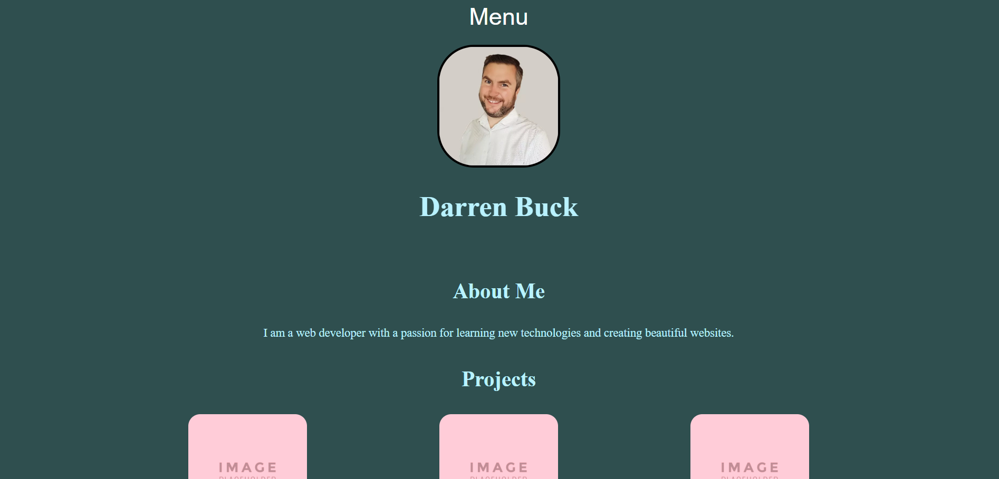

# MyPortfolio

## Description
Building my portifolio, seperately created CSS files for my Header, Footer, Layout and Dropdown.
Played a little with layout but could not get my boxes to laid out as I would like them.

 
 
Also played around with some HTML to make my portfolio image to spin when the mouse hovers over it.

## Application Image

 
 
## Application URLs
https://github.com/ParboldCoder/MyPortfolio
 
https://parboldcoder.github.io/MyPortfolio/
 
## Author
Darren Buck
https://github.com/ParboldCoder